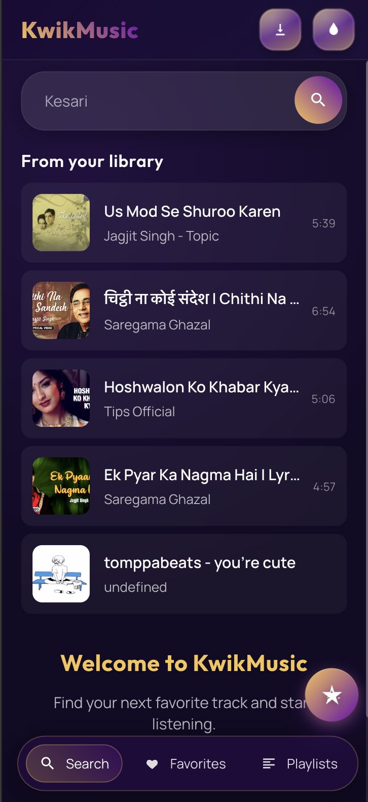
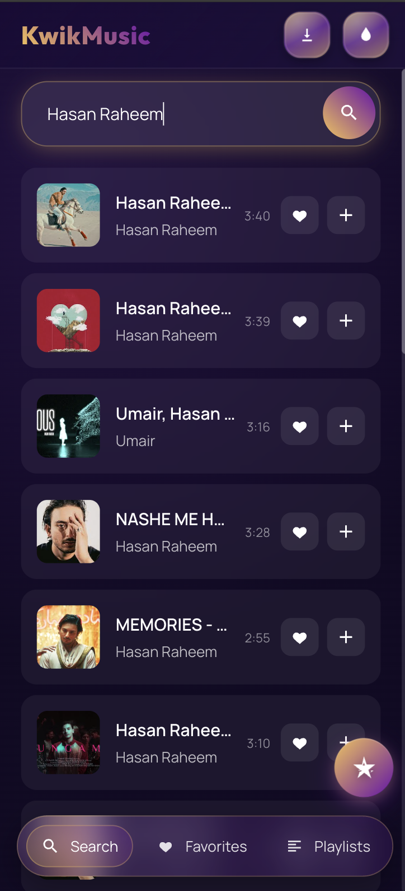
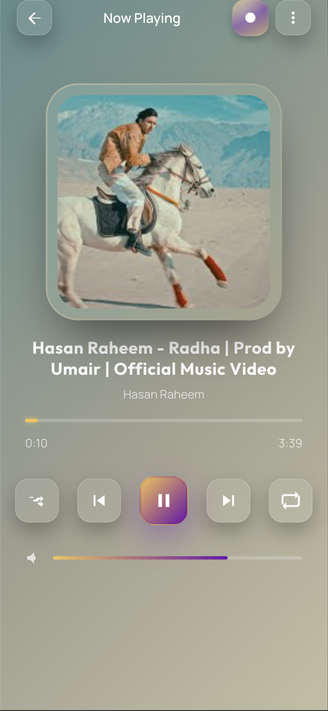
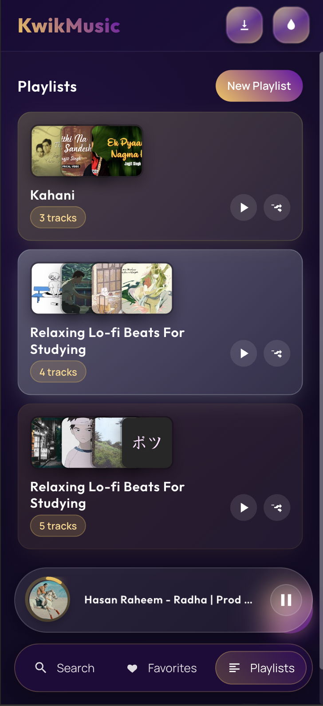
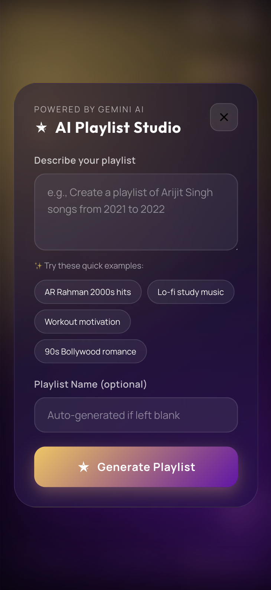
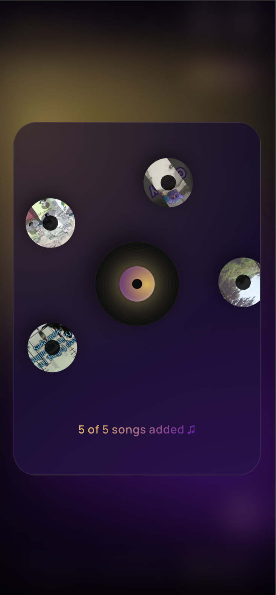
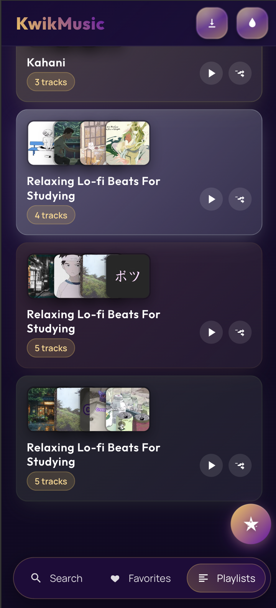

<div align="center">


# 🎵 KwikMusic

### *Your Music. Your Vibe. Everywhere.*

[](https://kwikmusicpersonal.netlify.app/)
[](https://web.dev/progressive-web-apps/)
[](LICENSE)

*A stunning Progressive Web App that brings YouTube music streaming to your fingertips with AI-powered playlists, offline recording, and a Pomodoro timer.*

[✨ Live Demo](https://kwikmusicpersonal.netlify.app/) • [📖 Documentation](./DEPLOY.md) • [🐛 Report Bug](https://github.com/AbuzarSiddiqi/kwikmusic-pwa/issues) • [💡 Request Feature](https://github.com/AbuzarSiddiqi/kwikmusic-pwa/issues)

</div>

---

## 🌟 Features That Make You Groove

<div align="center">

| 🎨 **Beautiful UI** | 🤖 **AI Playlists** | 📱 **PWA Ready** | 🎙️ **Audio Recording** |
|:---:|:---:|:---:|:---:|
| Dark theme with purple-pink gradients | Gemini AI generates custom playlists | Install on any device | Record & save your sessions |
| **⏱️ Pomodoro Timer** | **💾 Offline Support** | **🔄 Auto Sync** | **🎯 Smart Search** |
| Stay focused while you listen | Background playback & offline mode | Favorites & playlists sync | YouTube music search with filters |

</div>

### ✨ Highlights

- 🎭 **Stunning Vinyl Animations** - Watch records orbit during AI playlist generation
- 🎨 **Dynamic Color Extraction** - UI adapts to album artwork colors
- 🔐 **Secure by Design** - Environment variables, no hardcoded secrets
- 📲 **Install as App** - Works like a native app on iOS & Android
- 🎵 **Dual YouTube API** - Automatic key fallback for uninterrupted streaming
- 🧘 **Pomodoro Focus Mode** - 25-min work sessions with audio rewards
- 📡 **Media Session API** - Control playback from lock screen/notification

---

## � App UI Showcase

<div align="center">

### *Experience the Beauty*

<table>
  <tr>
    <td align="center" width="33%">
      
      <br />
      <sub><b>🔍 Smart Search</b></sub>
      <br />
      <sub>Instant YouTube music discovery</sub>
    </td>
    <td align="center" width="33%">
      
      <br />
      <sub><b>🎵 Now Playing</b></sub>
      <br />
      <sub>Dynamic color-adaptive player</sub>
    </td>
    <td align="center" width="33%">
      
      <br />
      <sub><b>❤️ Favorites</b></sub>
      <br />
      <sub>Your loved tracks, one tap away</sub>
    </td>
  </tr>
  <tr>
    <td align="center" width="33%">
      
      <br />
      <sub><b>📝 Playlists</b></sub>
      <br />
      <sub>Organize your music library</sub>
    </td>
    <td align="center" width="33%">
      
      <br />
      <sub><b>🤖 AI Playlists</b></sub>
      <br />
      <sub>Gemini-powered curation</sub>
    </td>
    <td align="center" width="33%">
      
      <br />
      <sub><b>🎭 Vinyl Animation</b></sub>
      <br />
      <sub>Mesmerizing loading experience</sub>
    </td>
  </tr>
  <tr>
    <td align="center" colspan="3">
      
      <br />
      <sub><b>🎨 Immersive Full Player</b></sub>
      <br />
      <sub>Gradient backgrounds from album art</sub>
    </td>
  </tr>
</table>

*Dark purple-pink gradients • Smooth animations • Responsive design*

</div>

---

## �🚀 Quick Start

### 🌐 Option 1: Deploy to Netlify (Recommended)

<div align="center">

[](https://app.netlify.com/start/deploy?repository=https://github.com/AbuzarSiddiqi/kwikmusic-pwa)

</div>

1. **Click the button above** or import from GitHub
2. **Set environment variables** in Netlify dashboard:
   ```
   GEMINI_API_KEY=your_gemini_key
   YOUTUBE_API_KEY_1=your_youtube_key_1
   YOUTUBE_API_KEY_2=your_youtube_key_2
   ```
3. **Deploy!** 🎉

> 📖 **Detailed Guide:** See [DEPLOY.md](./DEPLOY.md) for step-by-step instructions

---

### 💻 Option 2: Run Locally

#### Automatic Setup (Easiest)

**macOS/Linux:**
```bash
./setup-local.sh
```

**Windows:**
```cmd
setup-local.bat
```

#### Manual Setup

```bash
# 1. Clone the repository
git clone https://github.com/AbuzarSiddiqi/kwikmusic-pwa.git
cd kwikmusic-pwa

# 2. Copy environment template
cp .env.example .env

# 3. Edit .env with your API keys
nano .env  # or use your favorite editor

# 4. Inject keys into HTML
node inject-env.js

# 5. Open in browser
open index.html  # or use Live Server in VS Code
```

---

## 🔑 Getting API Keys

### 🤖 Gemini API Key (AI Playlists)

1. Visit [Google AI Studio](https://makersuite.google.com/app/apikey)
2. Click **"Create API key"**
3. Copy your key
4. ✅ Free tier: 60 requests/minute

### 📺 YouTube Data API Keys

1. Go to [Google Cloud Console](https://console.cloud.google.com/)
2. Create a new project
3. Enable **"YouTube Data API v3"**
4. Create **2 API keys** (for automatic fallback)
5. ✅ Free tier: 10,000 units/day per key

> 💡 **Pro Tip:** Using 2 YouTube keys provides 20,000 units/day with automatic failover!

---

## � Project Architecture

```
kwikmusic-pwa/
│
├── 🎨 Frontend (Single Page App)
│   ├── index.html              # Main app (8600+ lines of magic ✨)
│   ├── manifest.json           # PWA configuration
│   └── sw.js                   # Service Worker for offline support
│
├── 🎭 Assets
│   ├── images/                 # Logos, icons, artwork
│   └── css/                    # Responsive styles
│
├── ⚙️ Configuration
│   ├── netlify.toml            # Netlify build settings
│   ├── inject-env.js           # Environment variable injection
│   ├── .env.example            # Template for API keys
│   └── .gitignore              # Keeps secrets safe 🔒
│
└── 📖 Documentation
    ├── README.md               # You are here!
    ├── DEPLOY.md               # Deployment guide
    └── PWA_AUDIO_FIX.md       # PWA audio troubleshooting
```

---

## 🎯 Usage Guide

### � Search & Play
1. Open the app
2. Type a song name in the search bar
3. Click any result to play instantly
4. Add to favorites ❤️ or create playlists 📝

### 🤖 AI Playlist Generator
1. Click the **floating AI button** (bottom right)
2. Describe your mood: *"upbeat 90s pop songs"* or *"Arijit Singh romantic hits"*
3. Watch the vinyl animation as AI curates your playlist ✨
4. Playlist auto-saves and starts playing!

### ⏱️ Pomodoro Timer
1. Tap the timer icon in the header
2. Start a 25-minute focus session
3. Music auto-pauses during work time
4. Get a 5-minute break with music! 🎵

### 🎙️ Recording Feature
1. Play a song you love
2. Click the **Record** button
3. Capture audio from screen (or mic on iOS)
4. Access recordings in the Recordings tab
5. Play offline anytime! 📴

---

## 🛠️ Tech Stack

<div align="center">


</div>

**Core Technologies:**
- 🎨 **Vanilla JavaScript** - Pure JS, no frameworks
- 🎭 **CSS3 Animations** - Smooth transitions & keyframes
- 📱 **Service Workers** - Offline support & caching
- 🤖 **Gemini 1.5 Flash** - AI playlist generation
- 📺 **YouTube IFrame API** - Audio streaming
- 💾 **IndexedDB** - Local recording storage
- 🎵 **MediaRecorder API** - Audio capture
- 🔔 **Notifications API** - Pomodoro alerts

---

## 🔒 Security & Privacy

✅ **Environment Variables** - API keys injected at build time  
✅ **No Hardcoded Secrets** - Placeholder system for security  
✅ **Git History Cleaned** - No leaked keys in commit history  
✅ **HTTPS Only** - Secure communication  
✅ **No Data Collection** - Your data stays on your device  
✅ **Open Source** - Transparent codebase  

---

## 🐛 Troubleshooting

<details>
<summary><b>📱 PWA audio not playing on mobile</b></summary>

The app includes automatic fixes for PWA audio playback. If issues persist:

1. Uninstall the PWA and reinstall
2. Clear browser cache
3. Ensure you're running the latest version
4. Check [PWA_AUDIO_FIX.md](./PWA_AUDIO_FIX.md) for details

</details>

<details>
<summary><b>🔑 API key errors</b></summary>

**Local Development:**
```bash
# Verify .env file exists and has correct format
cat .env

# Re-inject keys
node inject-env.js

# Clear browser cache and reload
```

**Netlify Deployment:**
1. Check environment variables in Netlify dashboard
2. Ensure no extra quotes or spaces
3. Redeploy after updating variables

</details>

<details>
<summary><b>🎵 YouTube quota exceeded</b></summary>

The app uses **dual API keys** with automatic fallback:
- First key hits quota → Automatically switches to second key
- Both keys exhausted → Try again tomorrow (quota resets at midnight PST)
- Consider creating more API keys for higher usage

</details>

<details>
<summary><b>🤖 Gemini API not responding</b></summary>

1. Verify API key is valid at [Google AI Studio](https://makersuite.google.com/app/apikey)
2. Check free tier limits (60 requests/minute)
3. Ensure `GEMINI_API_KEY` is set correctly
4. Look for error messages in browser console (F12)

</details>

---

## � Customization

### Change Color Scheme

Edit the CSS variables in `index.html` (around line 40):

```css
:root {
  --km-bg-start: #0d0620;      /* Dark purple background */
  --km-bg-end: #1a1030;        /* Lighter purple */
  --km-accent: #6a0dad;        /* Primary accent (purple) */
  --km-accent-alt: #f6c453;    /* Secondary accent (gold) */
  --km-text: #fff;             /* Text color */
}
```

### Modify Pomodoro Duration

Search for `const WORK_DURATION` in `index.html` and adjust:

```javascript
const WORK_DURATION = 25 * 60; // 25 minutes (in seconds)
const BREAK_DURATION = 5 * 60; // 5 minutes
```

---

## 📊 Performance

<div align="center">

| Metric | Score |
|--------|-------|
| ⚡ **Lighthouse Performance** | 95+ |
| 🎨 **First Contentful Paint** | < 1.5s |
| 🖼️ **Largest Contentful Paint** | < 2.5s |
| 📱 **Mobile Optimized** | ✅ 100% |
| 💾 **Offline Ready** | ✅ Yes |
| 🔒 **HTTPS** | ✅ Enforced |

</div>

---

## 🤝 Contributing

Contributions make the open-source community amazing! Any contributions you make are **greatly appreciated**.

1. **Fork** the Project
2. **Create** your Feature Branch (`git checkout -b feature/AmazingFeature`)
3. **Commit** your Changes (`git commit -m 'Add some AmazingFeature'`)
4. **Push** to the Branch (`git push origin feature/AmazingFeature`)
5. **Open** a Pull Request

---

## � License

Distributed under the **MIT License**. See `LICENSE` for more information.

---

## 🙏 Acknowledgments

- 🎨 **Design Inspiration:** Spotify, Apple Music, YouTube Music
- 🤖 **AI Power:** Google Gemini
- 📺 **Streaming:** YouTube Data API
- 🎭 **Fonts:** Google Fonts (Manrope, Outfit)
- 💜 **Icons:** Custom SVG icon set
- 🚀 **Hosting:** Netlify

---

## 📞 Support & Contact

<div align="center">

**Built with 💜 by [Abuzar Siddiqi](https://github.com/AbuzarSiddiqi)**

[](https://github.com/AbuzarSiddiqi)
[](https://kwikmusicpersonal.netlify.app)

**Show some ❤️ by starring ⭐ this repository!**

</div>

---

<div align="center">

### 🎵 *"Where code meets melody"* 🎵

**[⬆ Back to Top](#-kwikmusic)**

</div>
